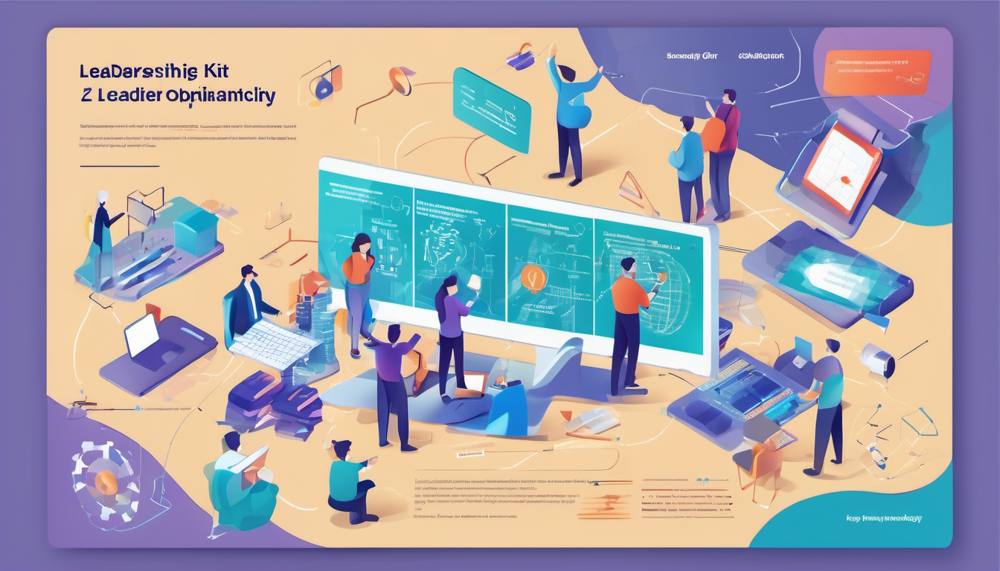

# DS-Leadership-Kit 🚀

Welcome to the DS Leadership Kit – your ultimate toolkit for empowering leadership in the dynamic realm of Data Science. Elevate your team's potential with curated resources, best practices, and collaborative tools designed to foster excellence in data science leadership.

## Key Features

### 1. Data Management Excellence 📊
Structured guidelines for maintaining impeccable data governance, versioning, and storage practices. Ensure your team's foundation is built on solid data management principles.

### 2. Model Development Strategies 🤖
Discover best practices for structuring, experimenting, and deploying machine learning models. Navigate the complexities of model development with confidence.

### 3. Deployment and Operations 🌐
Explore proven strategies for deploying data science solutions. From containerization to serverless architectures, optimize your deployment processes for efficiency and scalability.

### 4. Visualization and Communication 📈
Master the art of data visualization using preferred libraries and techniques. Effectively communicate insights to both technical and non-technical stakeholders.

### 5. Team Collaboration 🤝
Foster a collaborative environment within your data science team. Explore tools and platforms that enhance teamwork, communication, and knowledge sharing.

### 6. Learning Resources 📚
Access a curated list of training materials, conferences, and recommended books. Keep your team on the cutting edge of data science through continuous learning.

## Contributing 👥

We welcome contributions from the community! Whether it's improving existing content, adding new resources, or sharing your insights, your contributions help elevate the DS Leadership Kit. Please refer to our [Contribution Guidelines](CONTRIBUTING.md) for more details.

## License 📝

This repository is licensed under the [MIT License](LICENSE). Feel free to adapt and use it according to your team's needs.

## Explore the DS Leadership Kit!

🌐 **[Explore the DS Leadership Kit](#)** and take your data science leadership to new heights!

---

**Note:** Replace the placeholder URLs in the image tags (`./images/ds-leadership-kit-banner.png` and `./images/ds-leadership-kit-preview.png`) with the actual URLs or paths to your banner and preview images.

This README structure provides a clear and visually appealing introduction to the DS Leadership Kit, with sections highlighting key features, contribution guidelines, and licensing information. Customize it further based on your specific content and preferences.
